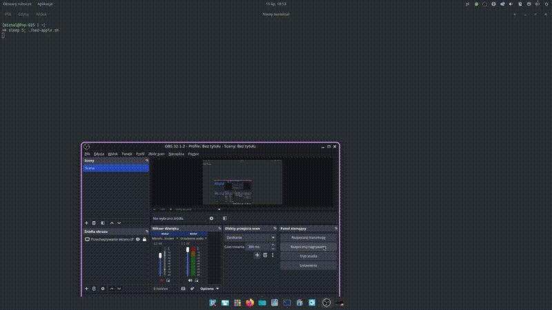

# **BadAppleBash - Bad Apple!! for the BASH terminal**

Hi guys! I decided to make Bad Apple!! for BASH, because most attempts at making this project either:

- A) Are too complicated
- B) Get desynced from audio (if there's any)
- C) Have low frame rates

Preview:



## Installation
the installation is ***DEAD SIMPLE***:

1. First, install dependencies:

- APT (Debian, Ubuntu, Mint):

  ```bash
  sudo apt install git mpv
  ```
- PacMan (Arch, CachyOS):
  ```bash
  sudo pacman -S git mpv
  ```
- Zypper (openSUSE):
  ```bash
  sudo zypper in git mpv
  ```

2. Clone the Repo:

```bash
git clone https://github.com/sorbetified/BadAppleBash.git
```
3. CD into the directory:

```bash
cd BadAppleBash
```

4. make bad-apple.sh executable:

```bash
chmod +x bad-apple.sh
```

5. Run the program:

```bash
./bad-apple.sh
```

and enjoy watching Bad Apple in your terminal at 30FPS with perfectly synced audio:)
##  Known issues
- pressing ’Ctrl+C’ only stops mpv from playing the audio, not the video.
- on low end or low performance devices and termux the video can get desynced with the audio, so recommended for PC only.

## Credits
Credits to @kasidid2 on youtube for the video and audio for this project

thank u for looking at this :)
